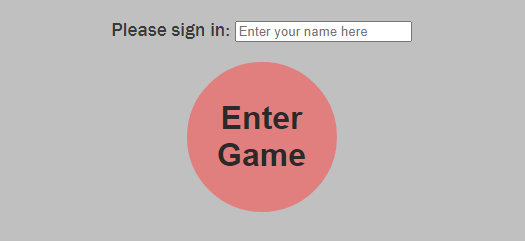

# HIGHER lower - A Game of Chance!

Higher Lower is an interactive, fully responsive game of chance.

The game will generate 5 random numbers between 1-20.  A user must sign-in to play the game.  The user is welcomed, and the first number of 5 is displayed.  The user must guess whether each consecutive number is Higher or Lower than the previous number.  The numbers will be kept hidden from the user until they select either the Higher/Lower button to guess the outcome of that number. The game will continue until either all 5 numbers have been correctly guessed, or an incorrect guess ends the game.

The user's score is counted and the Correct Answer score is displayed under the game area.

**note - to do**
[insert screenshot of deployed project here from http://amiresponsivedesign.is/website]
## Features
[include screenshots of each feature]

In this section, you should go over the different parts of your project, and describe each in a sentence or so. You will need to explain what value each of the features provides for the user, focusing on who this website is for, what it is that they want to achieve and how your project is the best way to help them achieve these things.

### Existing Features

#### Higher Lower Logo and Heading

Featured at the top of the page, the bespoke logo and heading is easy to see for the user. Upon viewing the page, the user will be able to see the name of the game.

Bespoke logo designed using the favicon.io generator https://favicon.io/

#### The Sign-in Area

The Sign-in Area contains a text input box, a submit button, and Directions on how to play the game.

The user is prompted to enter a username to the text input box both by the placeholder in the text input box, and by an alert message if the user tries to start the game without signing in.  

Once the user has entered a username into the text box, they must then click on the 'Enter Game' button to start the game.

The graphics of the 'Enter Game' button are consistent in style and colour with the game's icon for optimum user experience.

The user is then welcomed by name.

#### The Game Area

This section will be displayed to the user upon successfully signing in.

The user will be able to easily see five button icons displayed.  The first button icon displays the first number of the game.  The other four button icons display only a question mark.  The user will see two submit buttons below the five button icons, 'Higher' and 'Lower'.  The user selects either of these submit buttons to enter their guess and progress through the game.

#### The Score Area

This section will allow the user to see exactly how many correct answers they have provided.

In addition, you may also use this section to discuss plans for additional features to be implemented in the future:

Features Left to Implement
Another feature idea

## Testing
In this section, you need to convince the assessor that you have conducted enough testing to legitimately believe that the site works well. Essentially, in this part you will want to go over all of your project’s features and ensure that they all work as intended, with the project providing an easy and straightforward way for the users to achieve their goals.

In addition, you should mention in this section how your project looks and works on different browsers and screen sizes.

You should also mention in this section any interesting bugs or problems you discovered during your testing, even if you haven't addressed them yet.

If this section grows too long, you may want to split it off into a separate file and link to it from here.

Test that user is prompted to input a username before starting the game.  Click on 'Enter Game', pop-up alert displays.

### Bugs

The text input box revealed on testing that spacebar-only keypress would be accepted as a username.

**FIX this?**

Testing during the game showed a bug where the user clicking on any of the button icons displayed the same positive or negative alert messages that would be expected only when selecting the 'Higher' or 'Lower' buttons.  Adding the HTML [disabled](https://validator.w3.org/nu/?showsource=yes&showoutline=yes&showimagereport=yes&doc=https%3A%2F%2Fmonimurray.github.io%2Fhigher_lower%2F) attribute resolved this bug.

## Validator Testing

### Lighthouse

Lighthouse passed

### HTML
No errors were returned when passing through the official [W3C validator](https://validator.w3.org/nu/?showsource=yes&showoutline=yes&showimagereport=yes&doc=https%3A%2F%2Fmonimurray.github.io%2Fhigher_lower%2F).

### CSS
No errors were found when passing through the official (Jigsaw) validator
### JavaScript
No errors were found when passing through the official Jshint validator
The following metrics were returned:
There are 11 functions in this file.
Function with the largest signature takes 2 arguments, while the median is 0.
Largest function has 10 statements in it, while the median is 3.
The most complex function has a cyclomatic complexity value of 4 while the median is 2.
Unfixed Bugs
You will need to mention unfixed bugs and why they were not fixed. This section should include shortcomings of the frameworks or technologies used. Although time can be a big variable to consider, paucity of time and difficulty understanding implementation is not a valid reason to leave bugs unfixed.

## Deployment

The site was deployed to [GitHub pages](https://pages.github.com/).

The steps to deploy are as follows:

In the GitHub repository, navigate to the Settings tab; From the Code and Automation area on the left side of the page, select Pages; From the source section drop-down menu, select the Master Branch, select Save; The page will be automatically refreshed with a detailed ribbon display to indicate the successful deployment. Once again navigate to the Settings tab, and then to Pages where the live link can now be found.

The following is a live link to the site - https://monimurray.github.io/higher_lower/

## Credits

#### CI Love Maths

This walkthrough project gave me alot of ideas, both for appearance of my game through CSS and most particularly how to use JavaScript for the incrementing of user's scores throughout the game.

Stackoverflow

#### [Google](https://www.google.com/)

I relied on 'googling' many of my 'how to...' questions.  Google results varied between [W3Schools](https://www.w3schools.com/), on which I relied alot, [StackOverflow](https://stackoverflow.com/) and [YouTube](https://www.youtube.com/) videos.

#### [W3Schools](https://www.w3schools.com/)

I trialled using [JQuery](https://www.w3schools.com/jquery/default.asp) in this project to toggle images on and off on a mouse click, but in the end judged that using CSS was simpler and more effective.  I used [this](https://www.w3schools.com/howto/howto_js_remove_class.asp) link to learn how to add a styled class to the elements I wanted to show/hide.

[This](https://www.w3schools.com/js/js_if_else.asp) link helped me in resolving an error in if/else nested conditional statement, which was a missing semicolon in the middle of the code.

#### CI course content

When I couldn't quite remember how to do something taught in the course content, I reviewed it on the [LMS](https://learn.codeinstitute.net/ci_program/diplomainfullstacksoftwarecommoncurriculum)!

In this section you need to reference where you got your content, media and extra help from. It is common practice to use code from other repositories and tutorials, however, it is important to be very specific about these sources to avoid plagiarism.

You can break the credits section up into Content and Media, depending on what you have included in your project.

## Content

## Technologies used

This site was designed with HTML5, styled with CSS and made responsive using JavaScript and a little jQuery.

## Frameworks, Libraries & Programs

Website logo designed using Favicon https://favicon.io/

Wireframe sketched on Balsamiq Wireframes.

Site designed and deployed on Gitpod and Github.

## Acknowledgements

#### Mentor Support

Jubril rocks!!!  Enough said.

#### CI Tutor support

Guidance from Tutor Support was invaluable during the JavaScript section of this project.  Tutor Alex helped me source and resolve a problem with jquery.  It was not working because I downloaded jquery instead of including the following link: 
from here: https://releases.jquery.com/

#### Slack

The support from my own class cohort on Slack cannot be overstated.  The generosity of spirit in this group, and the kindness shown by people during stressful sections of the course content and project helped me carry on and, crucially, helped me think in a way that solved the problems as they arose.