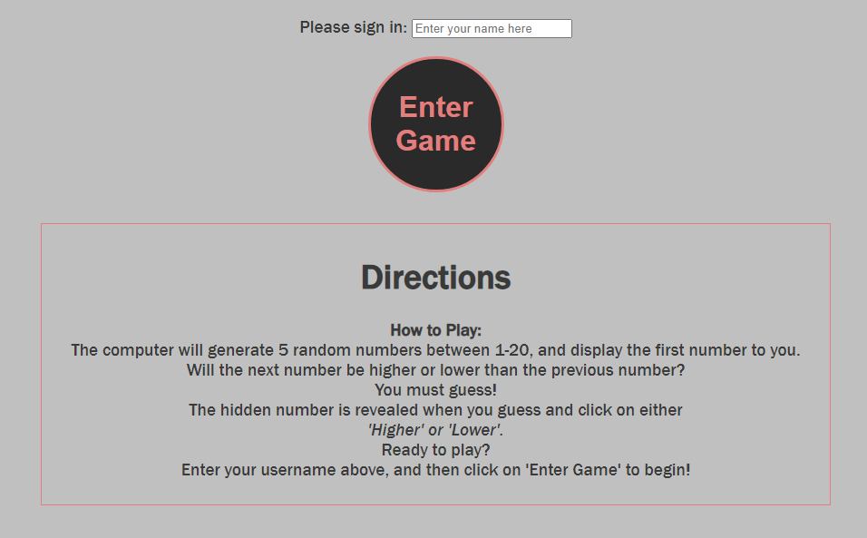
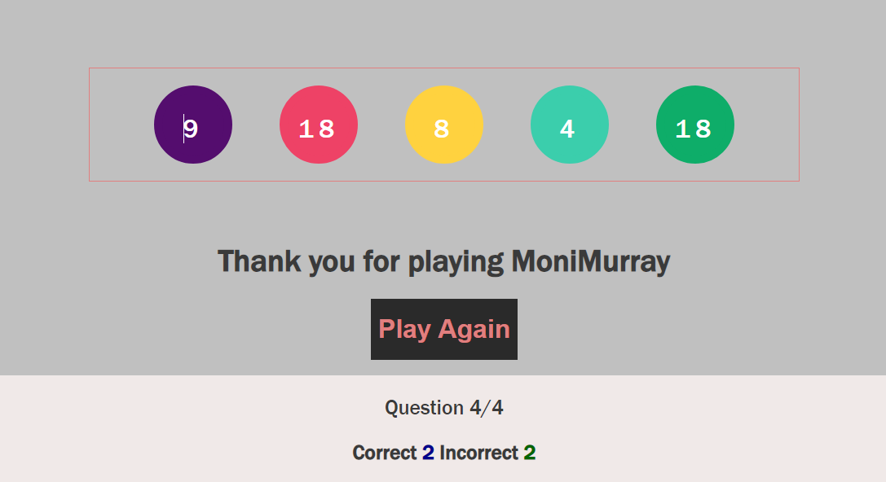

# HIGHER lower - A Game of Chance!

Higher Lower is an interactive, fully responsive game of chance.

The game generates 5 random numbers between 1-20.  A user must sign-in to play the game.  The user is welcomed, five brightly-coloured button icons display in a horizontal row and the first number of 5 is revealed with the remaining 4 numbers hidden behind a *question mark* on each button icon.  The user must guess whether each consecutive number is Higher or Lower than the previous number.  The numbers will be kept hidden from the user until they select either the Higher/Lower clickable button to guess the outcome of that number. The game will continue until all numbers have been correctly guessed.

The user's score is counted and the Correct Answer score is displayed under the game area.

[Responsivity](https://ui.dev/amiresponsive?url=%20https://monimurray.github.io/higher_lower/)

## Features

The game is designed for players of all ages. The directions are easy to understand and the game is uncomplicated to play.  A bright and clean colour palette was chosen for a positive user experience.  

### Existing Features

#### Higher Lower Logo and Heading

Featured at the top of the page, the bespoke logo and heading is easy to see for the user. Upon loading the page, the user will be presented with the name of the game.

Bespoke logo designed using the [favicon.io generator](https://favicon.io/)

#### The Sign-in Area

The Sign-in Area contains a text input box, a submit button, and Directions on how to play the game.

The user is prompted to enter a username to the text input box both by the placeholder in the text input box, and by an alert message if the user tries to start the game without signing in.  

Once the user has entered a username into the text box, they must then either mouse-click on the 'Enter Game' button, or keyboard press 'Enter' to start the game.

The graphics of the 'Enter Game' button are consistent in style and colour with the game's icon for optimum user experience.

The user's name is then populated in all game and browser messages.

#### The Game Area

This section will be displayed to the user upon successfully signing in, with a shorter game play instruction.

The user will be able to easily see five button icons displayed.  The first button icon displays the first number of the game.  The other four button icons display only a question mark.  The user will see two submit buttons below the five button icons, 'Higher' and 'Lower'.  The user selects either of these clickable buttons to enter their guess and progress through the game.

#### The Score Area

This section will allow the user to see exactly how many correct answers they have provided.

#### The RePlay Area

The user will have an option to re-play the game by clicking the 'Play Again' button.  Clicking this button will reload the game.

In addition, you may also use this section to discuss plans for additional features to be implemented in the future:

Features Left to Implement

[Pop-up messages[(https://www.w3schools.com/howto/howto_js_alert.asp)] 

#### Another feature idea

Another feature of the game in the future might be to have levels with a larger span of numbers generated from which the user will have to guess.

## Testing

- The website and functionality of the game were tested on Chrome, Firefox, and on several mobile device sizes for responsivity.

- Test that user is prompted to input a username before starting the game.  Click on 'Enter Game', pop-up message displays - pass

- Test that user name can be accepted by keyboard return - pass.

- Test that user can click-closed each of the in-game and windows alert messages that appear - pass.

- Test that username is used in the Welcome, Game Over message and windows replay alert - pass.

- Test that use of trim() method on the username input box restricts the game from being played if spacebar is pressed as 'keydown' - pass.

- Test that username is remembered on second and subsequent plays of the game - this is browser dependent and requires external game controle.

### Bugs

The text input box revealed on testing by colleagues on Slack that spacebar-only keypress would be accepted as a username.

Fixed with trim() at the end of my playerName variable value.

Testing during the game showed a bug where the user clicking on any of the button icons displayed the same positive or negative alert messages that would be expected only when selecting the 'Higher' or 'Lower' buttons.  Adding the HTML [disabled](https://validator.w3.org/nu/?showsource=yes&showoutline=yes&showimagereport=yes&doc=https%3A%2F%2Fmonimurray.github.io%2Fhigher_lower%2F) attribute resolved this bug.

In-programming testing showed that the question counter caused the game to stop at 3 1/2 iterations instead of running to the full 4.  

Resolved by taking the counter if/else statement out into it's own function to enable it run independently of other incrementing code and be called only when it is needed.

In playing the game, I discovered an unexpected '21' - the game scope is for numbers between 1-20.  

This was an oversight when generating the numbers randomly and was easily fixed - akin to a typo!

A bug that was a development and style issue, but a bug nevertheless, was that the message container, once called, would not re-appear again in the game during the guessing section of the game.  This was fixed by removing opacity from the css styling which was preventing the container from hiding and then re-showing during play.

A 404 favicon error persisted throughout testing.  I searched the error in the [CI Slack channel](https://app.slack.com/client/T0L30B202/search/search-eyJkIjoiNDA0JTIwZXJyb3IlMjBmYXZpY29uIiwicSI6IlUwM0tFREVWNkU4IiwiciI6IjQwNCUyMGVycm9yJTIwZmF2aWNvbiJ9/thread/C7HD37Q1F-1596806951.039200) and found a suggestion to use `<link rel="shortcut icon" href="#"/>>` in the `<Head>`, and this fixed the bug.

Pop-up messages must be user-clicked to close, otherwise they stack - no fix available.

## Validator Testing

### Lighthouse - passed

[Lighthouse passed](https://8000-monimurray-higherlower-xyb9xfikhiq.ws-eu72.gitpod.io/)

### HTML - passed

No errors were returned when passing through the official [W3C validator](https://validator.w3.org/nu/?showsource=yes&showoutline=yes&showimagereport=yes&doc=https%3A%2F%2Fmonimurray.github.io%2Fhigher_lower%2F).

### CSS - passed

Two minor errors were reported on first passing website through [W3C CSS Validator](https://jigsaw.w3.org/css-validator/).

Once addressed, Higher Lower [passed](https://jigsaw.w3.org/css-validator/validator?uri=https%3A%2F%2Fmonimurray.github.io%2Fhigher_lower%2F&profile=css3svg&usermedium=all&warning=1&vextwarning=&lang=en).

### JavaScript - passed

No errors were found when passing through the official Jshint validator

The following metrics were returned:
Metrics
There are 25 functions in this file.

Function with the largest signature take 2 arguments, while the median is 0.

Largest function has 18 statements in it, while the median is 4.

The most complex function has a cyclomatic complexity value of 6 while the median is 1.

One warning
Functions declared within loops referencing an outer scoped variable may lead to confusing semantics. (signIn, userGuess, checkGuess, counter, myReveal)

Four unused variables
- tallyCorrect
- tallyIncorrect
- answerCount
- ansCount

## Deployment

The site was deployed to [GitHub pages](https://pages.github.com/).

The steps to deploy are as follows:

In the GitHub repository, navigate to the Settings tab; From the Code and Automation area on the left side of the page, select Pages; From the source section drop-down menu, select the Master Branch, select Save; The page will be automatically refreshed with a detailed ribbon display to indicate the successful deployment. Once again navigate to the Settings tab, and then to Pages where the live link can now be found.

The following is a live link to the site - https://monimurray.github.io/higher_lower/

## Credits

#### CI Love Maths

This walkthrough project gave me alot of ideas, both for appearance of my game through CSS and most particularly how to use JavaScript for the incrementing of user's scores throughout the game, the DomLoading event listener and the user keypress 'Enter' to start the game.

Stackoverflow

#### [Google](https://www.google.com/)

I relied on 'googling' many of my 'how to...' questions.  Google results varied between [W3Schools](https://www.w3schools.com/), on which I relied alot, [StackOverflow](https://stackoverflow.com/) and [YouTube](https://www.youtube.com/) videos.

#### [W3Schools](https://www.w3schools.com/)

I trialled using [JQuery](https://www.w3schools.com/jquery/default.asp) in this project to toggle images on and off on a mouse click, but in the end judged that using CSS was simpler and more effective.  I used [this](https://www.w3schools.com/howto/howto_js_remove_class.asp) link to learn how to add a styled class to the elements I wanted to show/hide.

[This](https://www.w3schools.com/js/js_if_else.asp) link helped me in resolving an error in if/else nested conditional statement, which was a missing semicolon in the middle of the code.

In final touch ups I included [bespoke messages](https://www.w3schools.com/howto/howto_js_alert.asp) to the user using HTML, CSS and Javascript instead of more impersonal windows alerts, including [template literals](https://www.w3schools.com/js/tryit.asp?filename=tryjs_templates_quotes) in personalised messages.  [Replaying the game](https://www.w3schools.com/js/js_window_location.asp) was included by using the location.reload() property which I found [here](https://www.w3schools.com/jsref/met_loc_reload.asp).

I used [this YouTube video](https://www.youtube.com/watch?v=5sNGqsMpW1E) to add a simple shuffle to my numbers array.  This will be more useful in implementing the *future features* idea of a larger number span. Having played the game alot myself during production, it added a little fun to my work!

#### CI course content

When I couldn't quite remember how to do something taught in the course content, I reviewed it on the [LMS](https://learn.codeinstitute.net/ci_program/diplomainfullstacksoftwarecommoncurriculum)!

## Technologies used

This site was designed with HTML5, styled with CSS and made responsive using JavaScript and a little jQuery.

## Frameworks, Libraries & Programs

Website logo designed using Favicon https://favicon.io/

Wireframe sketched on Balsamiq Wireframes.

Site designed and deployed on Gitpod and Github.

## Wireframe

The Wireframe for this project was created using Balsamiq.

## Acknowledgements

#### Mentor Support

My mentor is so kind and supportive. Being reminded that we are colleagues, solving problems together, got me through the most stressful of days!

#### CI Tutor support

Guidance from Tutor Support was invaluable during the JavaScript section of this project.  

#### Slack

The support from my own class cohort on Slack cannot be overstated.  The generosity of spirit in this group, and the kindness shown by people during stressful sections of the course content and project helped me carry on and, crucially, helped me think in a way that solved the problems as they arose.  A great community.